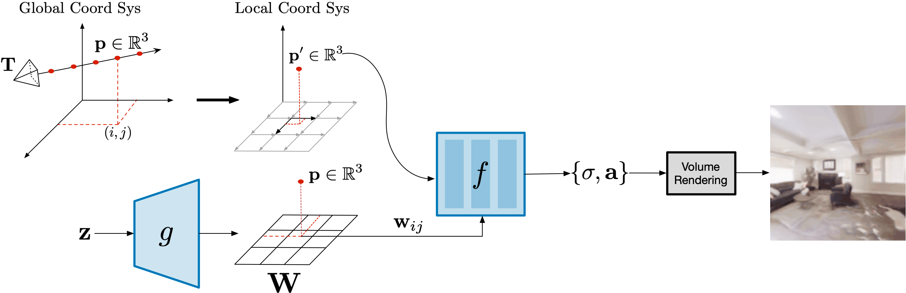
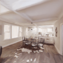
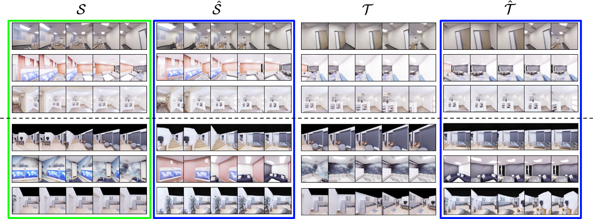

## Unconstrained Scene Generation with Locally Conditioned Radiance Fields [ICCV 2021](https://arxiv.org/abs/2104.00670)

<p align="center">
  
 &nbsp; &nbsp;
  
 &nbsp; &nbsp;
  
 &nbsp; &nbsp;
  
</p>

<p align="center">
  <a href="https://scholar.google.com/citations?user=VFPOOsoAAAAJ&hl=en&oi=ao">Terrance DeVries</a> (Apple),
  <a href="https://scholar.google.com/citations?hl=en&user=ZrRs-qoAAAAJ">Miguel Angel Bautista</a> (Apple), 
  <a href="https://scholar.google.com/citations?hl=en&user=s1PgoeUAAAAJ">Nitish Srivastava</a> (Apple), 
  <br>
  <a href="https://scholar.google.com/citations?hl=en&user=PUeKU8kAAAAJ">Graham W. Taylor</a> (University of Guelph, Vector Institute), 
  <a href="https://scholar.google.com/citations?hl=en&user=Sv2TGqsAAAAJ&view_op=list_works&sortby=pubdate">Joshua M. Susskind</a> (Apple)
</p>

## Summary
* We introduce Generative Scene Networks (GSN), a generative model which learns to synthesize radiance fields of indoor scenes.
* Decomposing large radiance fields into a collection of many small, locally conditioned radiance fields improves generation quality.
* GSN learns a useful scene prior, which can be leveraged for downstream tasks beyond scene synthesis.
<details>
  <summary>Expand Abstract</summary>
  
*We tackle the challenge of learning a distribution over complex, realistic, indoor scenes. In this paper, we introduce ___Generative Scene Networks___ (GSN), which learns to decompose scenes into a collection of many local radiance fields that can be rendered from a free moving camera. Our model can be used as a prior to generate new scenes, or to complete a scene given only sparse 2D observations. Recent work has shown that generative models of radiance fields can capture properties such as multi-view consistency and view-dependent lighting. However, these models are specialized for constrained viewing of single objects, such as cars or faces. Due to the size and complexity of realistic indoor environments, existing models lack the representational capacity to adequately capture them. Our decomposition scheme scales to larger and more complex scenes while preserving details and diversity, and the learned prior enables high-quality rendering from viewpoints that are significantly different from observed viewpoints. When compared to existing models, GSN produces quantitatively higher-quality scene renderings  across several different scene datasets.*
</details>


## Architecture
We follow an adversarial learning framework, where the generator models scenes via their radiance field, and the discriminator attempts to distinguish between images rendered from those radiance fields and images of real scenes. Conceptually, our model decomposes the radiance field of a scene into many small local radiance fields that result from conditioning on a 2D grid of latent codes __W__. __W__ can be interpreted as a _latent floorplan_ representing the scene.


 


## Results
We train GSN on scene level datasets composed of multiple scenes, generating views from a _freely moving_ camera, as opposed to synthesizing views on a _small baseline_ or a _viewing sphere_. 

<p align="center">
  
 <br>
 Small baseline camera movement (previous work)
 <br>
 &nbsp; <br>
 
 <br>
  Freely moving camera (ours)
</p>

### Scene Generation
  After training, we can _sample scenes_ from the learned prior and render them from an arbitrary camera pose, allowing for unconstrained scene exploration.

<p align="center">
  
 &nbsp; &nbsp;
  
 &nbsp; &nbsp;
  
 &nbsp; &nbsp;
  
 <br>
 Sampled scenes
</p>

### View Synthesis
  In addition, we can also use the prior learned by GSN to invert observations and fill in missing parts of the scene. Given source views _S_ we invert GSNs generator to generate a scene radiance field that minimizes a reconstruction error, we then render this radiance field from target camera poses _T_. 

<p align="center">
  
  <br>
  The images highlighted in green are inputs to GSN, images highlighted in blue are predicted views. The top 3 rows show results on training data and the bottom 3 rows show results on a held out test set.
</p>

### Scene Mirroring
  Our learned scene representation __W__ can be used for spatial scene editing. Specifically, we use it to show that we can mirror scenes by mirroring their _latent floorplan_ representation __W__.
  
<p align="center">
  
 &nbsp; &nbsp; &nbsp; &nbsp;
  
</p>

## Citation
```
@article{devries2021unconstrained,
    title={Unconstrained Scene Generation with Locally Conditioned Radiance Fields},
    author={Terrance DeVries and Miguel Angel Bautista and 
            Nitish Srivastava and Graham W. Taylor and 
            Joshua M. Susskind},
    journal={arXiv},
    year={2021}
}
```

## Source code
Code is available [here] (<https://github.com/apple/ml-gsn>)

## Related links
Check out recent related work on making radiance fields generalize to multiple objects/scenes:
- [PixelNeRF](https://github.com/sxyu/pixel-nerf)
- [GRAF](https://github.com/autonomousvision/graf)
- [pi-GAN](https://marcoamonteiro.github.io/pi-GAN-website/)
- [IBRNet](https://ibrnet.github.io)

